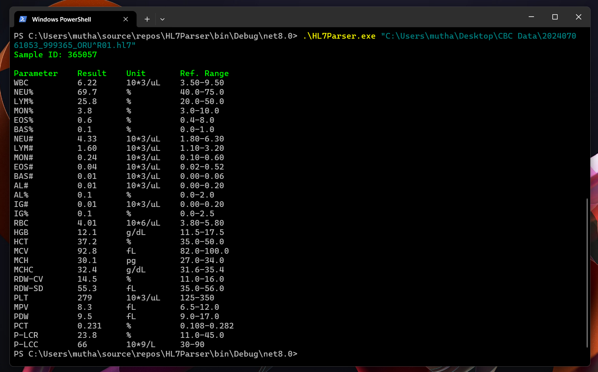

# HL7Parser
## Introduction
This is a parser for the [Swelab Lumi](https://boule.com/human-and-veterinary/swelab/swelab-lumi/) for its output which is in HL7 format. The main function of it is to convert the HL7 file into a more readable display for easy referencing. It's a C# console application and it takes the path of the file as an argument. Future updates would be to enter the HL7 text instead of the path of the output file. 

## Usage
Example use is below: 
```
.\HL7Parser.exe [PATH to HL7 file]
```

## Example
It was done by implementing [RegEx (Regular Expressions)](https://en.wikipedia.org/wiki/Regular_expression) using the System.Text.RegularExpressions library in C#. Below is a picture of a successful run.


## Useful Links
- [HL7 Parsing Guide.](https://www.parsehog.com/hl7/parser)
- [RegEx Testing Playground.](https://regexr.com/)
- [Great C# Tutorials.](https://www.youtube.com/@IAmTimCorey)
